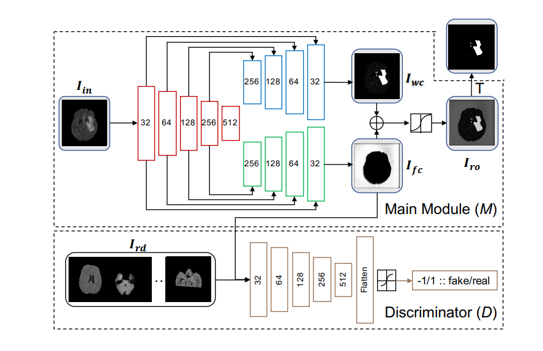
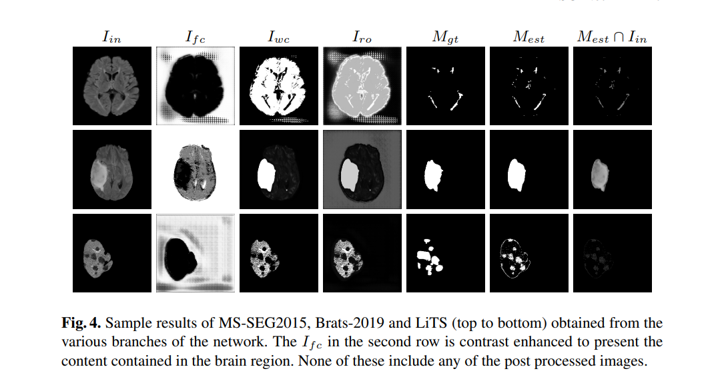

## ASC Net summary

### Introduction
ASC-Net is a framework which allows us to <strong>define a Reference Distribution Set</strong> and then take in <strong>any Input Image</strong> and <strong>compare with the Reference Distribution</strong> and <strong>throw out anomalies</strong> present in the Input Image. The kind of cases where this is useful is when you have some images/signals where you are aware of its contents and then you get a set of new images and you want to see if the new images differ from the original set aka anomaly/novelty detection.

### Archive Link 

https://arxiv.org/pdf/2103.03664.pdf

### Highlights

1. Solves the difficulty in defining a class/set of things deterministically down to the nitty gritty details. The Reference Distribution can work on any combination of image set and abstract out the manifold encompassing them.
2. No need of perfect reconstruction. We care about the anomaly not the reconstruction unlike other existing algorithms. State of the art performance!
3. We can potentially define any manifold using Reference Distribution and then compare any incoming input image to it. 
4. Works on any image sizes. Simply adjust the size of the encoder/decoder sets to match your input size and hardware capacity. 
5. ***The claim of "independent of instability of GANs" holds since the final termination is not dependent on the adversarial training. We terminate when the I(ro) output has split into distinct peaks. i.e. at each time do a stage of discriminator/main module cycle, go check the I(ro) if peak seperation obtained terminate training.***

### Network Architecture

### High level Summary [Short Video]

### Important

***Always take threshold on the reconstruction i.e. ID3 in the code section as it summarizes the two cuts in one place*** 

## Code

### Dependencies/Environment used

* [CUDA](https://developer.nvidia.com/cuda-90-download-archive) - CUDA-9.0.176
* [CUDNN](https://developer.nvidia.com/cudnn-download-survey) - CUDNN- Major 6; Minor 0; PatchLevel 21 
* [Python](https://www.python.org/downloads/) - Version 2.7.12 
* [Tensorflow](https://www.tensorflow.org/install) - Version 1.10.0
* [Keras](http://www.keras.io) - Version 2.2.2
* [Numpy](http://www.numpy.org/) - Version 1.15.5
* [Nibabel](https://nipy.org/nibabel/) - Version 2.2.0
* [Open-CV](https://opencv.org/releases/) - Version 2.4.9.1
* [Brats 2019](https://ipp.cbica.upenn.edu/) - Select Brats 2019
* [LiTS](https://competitions.codalab.org/competitions/17094) - LiTS Website
* [MS-SEG 2015](https://smart-stats-tools.org/lesion-challenge) - MS-SEG2015 website
* [12 gb TitanX]

### Code Summary [Short Video. I havent YET commented the code so watch this for a walkthrough :>]

### Comments 

- ID1 is Ifc
- ID2 is Iwc
- ID3 is Iro. ***Please take threshold on this*** 

### Data Files/Inputs

1. To make the frame work function we require 2 files [Mandatory!!!!]
    - Reference Distribution - Named ***good_dic_to_train_disc.npy*** for our code 
    > This is the image set which we know something about. This forms a manifold.
    - Input Images - Named ***input_for_generator.npy*** for our code
    > These can contain any thing the framework will split it into two halves with one halves consisting of components of the input image in the manifold of the Reference distribution and the other being everything else/anomaly.

2. Ground truth for the anomaly we want to test for [Optional used during testing]
    - Masks - Named ***tumor_mask_for_generator.npy*** for our code
    > The framework is able to throw out anomaly without needing any guidance from a ground truth. However to check performance we may want to include a mask for anomalies of the input image set we use above. In real life scenarios we wont have these and we dont need these.

### Source File 

#### Initial Conditions

- The framework is initialized with input shape 160x160x1 for MS-SEG experiments. Please update this according to your needs.
- Update the path variables for the folders in case you want to visualize the network output while training it
- To change the base network please change the build_generator and build_discriminator methods

#### File Sequence to Run

- create_networks.py 
    > This creates the network mentioned in our paper. If you need a network with different architecture please edit this file accordingly and update the baseline structures of the encoder/decoder. Try to keep the final connections intact. 
    - After running this you will obtain three h5 files 
        - disjoint_un_sup_mse_generator.h5 : This is the main module in the network diagram above
        - disjoint_un_sup_mse_discriminator.h5 : This is the discriminator in the network diagram above
        - disjoint_un_sup_mse_complete_gans.h5 : This is a completed version of the entire network diagram

- continue_training_stage_1.py
    > Stage 1 training. Read the paper!

- continue_training_stage_2.py
    > Stage 2 training. Read the paper!

### Results 

